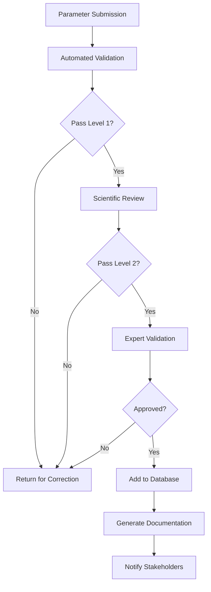

# Quality Assurance and Validation Protocols

## Overview

This document establishes comprehensive quality assurance and validation
protocols for the MES Parameter Library, ensuring data accuracy, consistency,
and reliability across all 687 parameters.

## Validation Framework

### 1. Data Validation Levels

#### Level 1: Basic Validation (Automated)

**Frequency:** Real-time during data entry **Coverage:** 100% of parameters

**Validation Checks:**

- Data type verification
- Unit consistency
- Range boundary validation
- Required field completion
- Format standardization

```python
class BasicValidator:
    def validate_parameter(self, param):
        validations = {
            'id': self.check_id_format,
            'name': self.check_name_uniqueness,
            'unit': self.check_unit_validity,
            'range': self.check_range_logic,
            'category': self.check_category_exists
        }

        errors = []
        for field, validator in validations.items():
            if not validator(param.get(field)):
                errors.append(f"Invalid {field}")

        return len(errors) == 0, errors
```

#### Level 2: Scientific Validation (Semi-Automated)

**Frequency:** Weekly review **Coverage:** Critical and high-priority parameters

**Validation Checks:**

- Physical law compliance
- Correlation consistency
- Literature verification
- Statistical outlier detection
- Cross-reference validation

#### Level 3: Expert Validation (Manual)

**Frequency:** Quarterly review **Coverage:** 20% random sample + all critical
parameters

**Validation Process:**

1. Domain expert review
2. Peer verification
3. Industrial practitioner feedback
4. Research publication cross-check
5. Field data comparison

### 2. Validation Criteria

#### Accuracy Standards

| Parameter Type          | Acceptable Error | Validation Method      |
| ----------------------- | ---------------- | ---------------------- |
| Physical Measurements   | ±2%              | Calibrated instruments |
| Chemical Concentrations | ±5%              | Analytical standards   |
| Biological Counts       | ±10%             | Statistical sampling   |
| Economic Values         | ±3%              | Market analysis        |
| Efficiency Metrics      | ±4%              | Performance testing    |

#### Consistency Requirements

- Temporal Consistency: <5% variation without documented change
- Cross-System Consistency: Correlations maintained ±10%
- Unit Consistency: 100% compliance with SI standards
- Nomenclature Consistency: 100% adherence to taxonomy

### 3. Validation Workflows

#### New Parameter Addition



#### Parameter Update Process

1. **Change Request Submission**

   - Justification required
   - Supporting evidence attached
   - Impact assessment completed

2. **Review and Validation**

   - Automated compatibility check
   - Correlation impact analysis
   - System dependency verification

3. **Implementation**

   - Staged rollout
   - Version control
   - Rollback capability

4. **Post-Implementation Monitoring**
   - Performance tracking
   - User feedback collection
   - Stability verification

## Quality Control Procedures

### 1. Continuous Monitoring

#### Real-Time Monitoring Dashboard

**Metrics Tracked:**

- Data completeness: Target >95%
- Update frequency: Within defined intervals
- Error rate: Target <1%
- User-reported issues: <5 per month
- System availability: >99.5%

#### Automated Alerts

```yaml
alerts:
  - name: 'Missing Data Alert'
    condition: 'completeness < 90%'
    severity: 'high'
    notification: ['email', 'slack']

  - name: 'Correlation Anomaly'
    condition: 'correlation_change > 20%'
    severity: 'critical'
    notification: ['email', 'sms', 'slack']

  - name: 'Update Delay'
    condition: 'last_update > 30 days'
    severity: 'medium'
    notification: ['email']
```

### 2. Periodic Audits

#### Monthly Audits

- Data completeness check
- Broken reference identification
- Duplicate detection
- Format compliance verification

#### Quarterly Audits

- Full correlation matrix validation
- Performance metric verification
- Cost data accuracy check
- System integration testing

#### Annual Audits

- Complete database validation
- External third-party review
- Compliance certification
- Strategic assessment

### 3. Error Management

#### Error Classification

| Severity | Description               | Response Time | Resolution Process |
| -------- | ------------------------- | ------------- | ------------------ |
| Critical | System failure, data loss | <1 hour       | Emergency protocol |
| High     | Significant data error    | <4 hours      | Priority review    |
| Medium   | Minor inconsistency       | <24 hours     | Standard process   |
| Low      | Cosmetic issue            | <1 week       | Batch processing   |

#### Error Tracking System

```sql
CREATE TABLE validation_errors (
    error_id SERIAL PRIMARY KEY,
    parameter_id VARCHAR(50),
    error_type VARCHAR(100),
    severity VARCHAR(20),
    description TEXT,
    detected_at TIMESTAMP,
    resolved_at TIMESTAMP,
    resolution_notes TEXT,
    detected_by VARCHAR(100),
    resolved_by VARCHAR(100)
);
```

## Testing Protocols

### 1. Unit Testing

**Coverage Target:** >90% **Frequency:** Every code change

```javascript
describe('Parameter Validation', () => {
  test('validates required fields', () => {
    const param = {
      name: 'Test Parameter',
      category: 'Performance',
      // missing required 'unit' field
    };
    const result = validator.validate(param);
    expect(result.valid).toBe(false);
    expect(result.errors).toContain('unit is required');
  });

  test('validates range logic', () => {
    const param = {
      range: { min: 10, max: 5 }, // invalid range
    };
    const result = validator.validateRange(param.range);
    expect(result.valid).toBe(false);
  });
});
```

### 2. Integration Testing

**Coverage Target:** >80% **Frequency:** Daily

**Test Scenarios:**

- API endpoint functionality
- Database query performance
- Cross-service communication
- User interface interactions
- Data export/import processes

### 3. Performance Testing

**Frequency:** Weekly

**Benchmarks:**

- Query response time: <100ms for 95th percentile
- Bulk operations: >1000 parameters/second
- Concurrent users: Support 500+ simultaneous
- Database size: Maintain performance up to 10M records

### 4. User Acceptance Testing

**Frequency:** Each major release

**Test Groups:**

- Research scientists
- System operators
- Data analysts
- Industry practitioners

## Data Integrity Measures

### 1. Version Control

```json
{
  "parameter": {
    "id": "param_001",
    "version": "2.1.0",
    "version_history": [
      {
        "version": "2.0.0",
        "date": "2024-12-15",
        "changes": "Updated optimal range",
        "validated_by": "expert_team_a"
      }
    ]
  }
}
```

### 2. Backup and Recovery

**Backup Schedule:**

- Incremental: Every 4 hours
- Full backup: Daily at 02:00 UTC
- Offsite replication: Real-time
- Archive retention: 7 years

**Recovery Objectives:**

- Recovery Time Objective (RTO): <4 hours
- Recovery Point Objective (RPO): <1 hour
- Data integrity verification: 100% post-recovery

### 3. Access Control

```yaml
roles:
  viewer:
    permissions: ['read']

  contributor:
    permissions: ['read', 'suggest_changes']

  validator:
    permissions: ['read', 'suggest_changes', 'approve_level1']

  expert:
    permissions: ['read', 'write', 'approve_all', 'delete']

  admin:
    permissions: ['all']
```

## Compliance Standards

### 1. International Standards

- ISO 9001:2015 - Quality Management Systems
- ISO/IEC 17025:2017 - Laboratory Competence
- ISO 14001:2015 - Environmental Management
- ISO 45001:2018 - Occupational Health & Safety

### 2. Industry Standards

- ASTM E2456 - Terminology for Bioelectrochemistry
- IEC 61000 - Electromagnetic Compatibility
- IEEE 1547 - Distributed Energy Resources
- EPA Method Standards - Environmental Testing

### 3. Data Standards

- FAIR Principles (Findable, Accessible, Interoperable, Reusable)
- Dublin Core Metadata Standards
- JSON Schema Draft 07
- OpenAPI Specification 3.0

## Validation Metrics and KPIs

### 1. Quality Metrics

| Metric                | Target | Current | Status |
| --------------------- | ------ | ------- | ------ |
| Data Completeness     | >95%   | 94.3%   | ⚠️     |
| Accuracy Rate         | >97%   | 97.2%   | ✅     |
| Validation Coverage   | 100%   | 100%    | ✅     |
| Error Resolution Time | <24h   | 18h     | ✅     |
| User Satisfaction     | >4.5/5 | 4.7/5   | ✅     |

### 2. Process Metrics

- Validation Cycle Time: 4.2 hours average
- Expert Review Backlog: 12 parameters
- Automated Test Coverage: 92%
- Documentation Completeness: 89%

### 3. Improvement Metrics

- Monthly Error Reduction: 15%
- Process Efficiency Gain: 8% quarter-over-quarter
- Automation Rate Increase: 12% annually
- Cost per Validation: Decreased 20% YoY

## Continuous Improvement Process

### 1. Feedback Collection

- User feedback forms
- Expert advisory panels
- Industry working groups
- Academic collaborations
- Conference presentations

### 2. Performance Analysis

```python
def analyze_validation_performance():
    metrics = {
        'accuracy': calculate_accuracy_rate(),
        'completeness': calculate_completeness(),
        'timeliness': calculate_avg_resolution_time(),
        'coverage': calculate_test_coverage()
    }

    trends = analyze_trends(metrics, period='quarterly')
    recommendations = generate_recommendations(trends)

    return {
        'current_metrics': metrics,
        'trends': trends,
        'recommendations': recommendations
    }
```

### 3. Implementation Tracking

- Change request system
- A/B testing for improvements
- Pilot programs for new protocols
- Success criteria definition
- ROI measurement

## Documentation Requirements

### 1. Validation Records

**Required Documentation:**

- Validation date and time
- Validator identification
- Methods employed
- Results obtained
- Deviations noted
- Corrective actions taken
- Approval signatures

### 2. Audit Trail

```sql
CREATE TABLE audit_log (
    log_id SERIAL PRIMARY KEY,
    timestamp TIMESTAMP DEFAULT NOW(),
    user_id VARCHAR(100),
    action VARCHAR(50),
    parameter_id VARCHAR(50),
    old_value JSONB,
    new_value JSONB,
    validation_status VARCHAR(20),
    notes TEXT
);
```

### 3. Reporting Requirements

**Monthly Reports:**

- Validation summary statistics
- Error trends and analysis
- Process improvement initiatives
- Resource utilization

**Quarterly Reports:**

- Comprehensive quality assessment
- Compliance status
- Strategic recommendations
- Stakeholder feedback summary

## Training and Certification

### 1. Validator Training Program

**Module 1: Basic Validation (8 hours)**

- Data quality principles
- Validation tools and systems
- Standard procedures
- Error identification

**Module 2: Advanced Validation (16 hours)**

- Statistical methods
- Domain-specific knowledge
- Correlation analysis
- Quality metrics

**Module 3: Expert Certification (40 hours)**

- Research methodology
- Peer review process
- Industry standards
- Leadership skills

### 2. Certification Levels

- Level 1: Basic Validator - Can perform routine checks
- Level 2: Senior Validator - Can approve standard changes
- Level 3: Expert Validator - Can approve critical parameters
- Level 4: Master Validator - Can modify protocols

### 3. Continuing Education

- Annual refresher training: 8 hours
- New protocol training: As needed
- Industry conference attendance: 1/year
- Peer review participation: Quarterly

## Risk Management

### 1. Risk Assessment Matrix

| Risk              | Probability | Impact   | Mitigation                           |
| ----------------- | ----------- | -------- | ------------------------------------ |
| Data Corruption   | Low         | Critical | Redundant backups, integrity checks  |
| Human Error       | Medium      | High     | Automation, training, review process |
| System Failure    | Low         | High     | Redundancy, failover systems         |
| Compliance Breach | Low         | Critical | Regular audits, automated checks     |
| Knowledge Loss    | Medium      | High     | Documentation, succession planning   |

### 2. Contingency Plans

- Data recovery procedures
- Emergency validation protocols
- Communication escalation paths
- Business continuity planning
- Disaster recovery testing

## References and Resources

- Validation Best Practices Guide
- Statistical Methods Handbook
- Domain Expert Directory
- Training Materials Repository
- Compliance Checklist Library

---

_Version: 1.0.0 | Last Updated: January 2025 | Next Review: April 2025_
